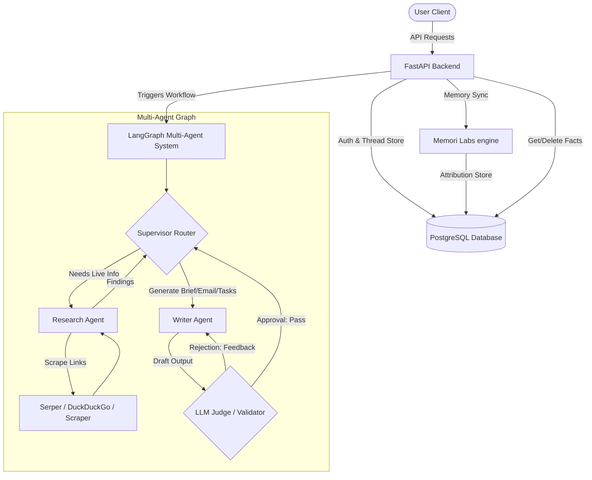

# Business Research Copilot — AI SMB Analyst

Business Research Copilot is a production-grade, SMB-focused AI web application that enables non-technical business users (e.g. CEOs, sales leads, founders) to research target companies on the web, draft tailored sales outreach copy, compile follow-up action checklists, and manage AI-learned long-term preferences over time.

This project was built from scratch to satisfy the M32 Fullstack + AI Take-Home prompt, optimizing for modern agentic patterns, SQL-native persistence, and absolute local reproducibility.

---

## What the Product Does
The application operates as a dedicated research assistant:
1. **Secure Registration & Recovery**: Users can sign up, log in, request password reset tokens (logged locally to server console), and reset their passwords.
2. **Context-Aware Research Chat**: Users discuss target companies, target profiles, and pitches.
3. **Multi-Agent Research Pipeline**: The assistant uses web search tool routines to query Google/DuckDuckGo, scrapes link content, summarizes page structures, and drafts outputs.
4. **LLM-as-a-Judge Validation**: An automated Critic node reviews drafts, ensuring factual consistency, source citations, and professional formatting, looping back to the Writer if revisions are needed.
5. **Durable Memory settings**: Powered by **Memori** (by MemoriLabs), the assistant extracts facts (e.g., target profile limits, preferred outreach templates) and saves them in standard SQL tables, recalling them across chat threads. An interactive ChatGPT-style "Manage Memory" settings pane allows users to view and delete these facts.

---

## Tech Stack
*   **Frontend**: React (Vite, TypeScript, React Router, React Markdown, Lucide Icons)
*   **Frontend Styling**: Custom Vanilla CSS (Dark Space theme, Glassmorphism, animations)
*   **Backend API**: Python + FastAPI
*   **Database**: PostgreSQL
*   **ORM**: SQLAlchemy 2.0 (Strict mapped type annotations)
*   **Package Manager & Dependency Compiler**: `uv` (by Astral)
*   **Orchestration**: Docker & Docker Compose
*   **Agent Logic**: LangGraph + LangChain + Google Gemini (`gemini-2.5-flash` & `gemini-2.5-pro`)
*   **Long-Term Memory**: Memori (by MemoriLabs)
*   **Search**: Serper API (Google Organic Search) with DuckDuckGo Search fallback

---

## Architecture Overview



---

## Folder Structure

```text
smb-research-copilot/
├── backend/
│   ├── app/
│   │   ├── api/
│   │   │   └── v1/
│   │   │       ├── routes/
│   │   │       │   ├── auth.py          # Signup, Login, Password Reset, Me
│   │   │       │   ├── chats.py         # Thread listing & creation
│   │   │       │   ├── messages.py      # Conversation history & agent chat
│   │   │       │   ├── memory.py        # GET & DELETE Memori facts for UI
│   │   │       │   └── actions.py       # Runs structured agent modes
│   │   │       └── router.py            # Routes aggregator
│   │   ├── core/
│   │   │   ├── config.py                # Environment variables
│   │   │   ├── database.py              # SQLAlchemy engine & DB sessions
│   │   │   └── security.py              # Password hashing & JWT helpers
│   │   ├── models/                      # SQLAlchemy Declarative Models
│   │   │   ├── base.py
│   │   │   ├── user.py                  # Includes google_id placeholder
│   │   │   ├── chat.py                  # Thread sessions
│   │   │   └── message.py               # Message records with JSON metadata
│   │   ├── schemas/                     # Pydantic v2 Schemas (ConfigDict)
│   │   ├── services/
│   │   │   ├── auth_service.py          # Registration & Token Reset
│   │   │   └── memory_service.py        # Memori framework wrappers
│   │   ├── agents/                      # LangGraph multi-agent implementation
│   │   │   ├── graph.py                 # Graph definition & compilation
│   │   │   ├── supervisor.py            # Routing orchestrator
│   │   │   ├── researcher.py            # Search executor
│   │   │   ├── writer.py                # Content generator
│   │   │   ├── judge.py                 # LLM Critic / validator
│   │   │   └── state.py                 # Graph states schema
│   │   ├── tools/
│   │   │   ├── web_search.py            # Serper API + DuckDuckGo fallback
│   │   │   └── page_fetch.py            # Web scraper (BeautifulSoup)
│   │   └── main.py                      # FastAPI App initialization & lifespan
│   ├── alembic/                         # Database migration versions
│   ├── tests/                           # Pytest unit & API smoke tests
│   ├── Dockerfile                       # Multi-stage python image compiling with uv
│   └── pyproject.toml                   # Project dependencies
├── frontend/
│   ├── src/
│   │   ├── api/
│   │   │   └── client.ts                # Axios client with session handlers
│   │   ├── components/
│   │   │   ├── layout/AppLayout.tsx     # Workspace sidebar, user profile card
│   │   │   ├── memory/MemoryManager.tsx # Memory viewing & fact deletion dashboard
│   │   │   └── ui/                      # Button, Input, Spinner, Toast wrappers
│   │   ├── pages/                       # Login, Signup, Forgot/Reset, Chat
│   │   ├── App.tsx                      # Routes map
│   │   └── index.css                    # Design styles (Vibrant space HSL theme)
│   └── Dockerfile                       # Node container for development
├── docker-compose.yml                   # DB, Backend, Frontend coordination
├── .env.example                         # Environment configuration template
└── README.md
```

---

## Local Setup & Run Instructions

### Prerequisites
*   Docker & Docker Compose installed and running locally.
*   A Google Gemini API Key (**required** for agent completions). Get yours free at [Google AI Studio](https://aistudio.google.com/app/apikey).
*   A Serper.dev API Key (Optional. If not provided, search falls back to DuckDuckGo).

### 1. Environment Configuration
Copy the `.env.example` file to `.env` at the root of the project:
```bash
cp .env.example .env
```
Open `.env` and fill in your keys:
```text
GEMINI_API_KEY=your-gemini-api-key-here
SERPER_API_KEY=your-serper-api-key-here   # optional
```

Also set up the backend local `.env` (needed when running outside Docker):
```bash
cp backend/app/.env.example backend/.env
```

### 2. Booting the Application
Execute Docker Compose to build and start all containers (PostgreSQL database, FastAPI backend, React frontend):
```bash
docker-compose up --build
```
Once the logs settle:
*   **React Frontend**: accessible at `http://localhost:5173`
*   **FastAPI Backend**: accessible at `http://localhost:8000/api/v1`
*   **Swagger API Docs**: accessible at `http://localhost:8000/docs`

### 3. Running Locally (without Docker)

**Backend** (requires Python 3.12+, `uv`, and a running PostgreSQL instance):
```bash
cd backend
uv pip install -r pyproject.toml
uvicorn app.main:app --reload --port 8000
```

**Frontend** (requires Node 20+):
```bash
cd frontend
npm install
npm run dev
```

---

## Testing

### Automated Test Suite
Run the full pytest test suite locally:
```bash
cd backend
.venv/Scripts/python -m pytest tests/ -v    # Windows
# or
python -m pytest tests/ -v                  # Linux / macOS (inside Docker)
```

Or inside the running Docker container:
```bash
docker-compose exec backend pytest tests/ -v
```

The test suite covers:
- ✅ Health check endpoint
- ✅ User signup (success, duplicate email, short password, invalid email)
- ✅ User login (success, wrong password, unknown email)
- ✅ Protected `/me` endpoint (authenticated and unauthenticated)
- ✅ Forgot-password flow
- ✅ Chat creation and listing
- ✅ Message history retrieval
- ✅ 404 handling for non-existent resources

### Manual Walkthrough
1. Go to `http://localhost:5173/signup` and register an account.
2. Sign in at `/login` with your credentials.
3. Chat with the copilot. Provide your preference: *"My target audience is small marketing firms."*
4. Click the **Manage Memory** button at the bottom of the sidebar. You will see that **Memori** has scanned your message, extracted that preference, and saved it in the PostgreSQL memory tables.
5. Go back to chat, start a **New Research Chat** thread, and ask: *"Who should I pitch sales automation to?"* Notice that the agent immediately remembers your target audience from the previous thread!
6. Click **Manage Memory** and click the trash can icon next to the target audience preference.
7. Return to the chat, ask the same question, and verify the agent no longer holds that preference.
8. Type *"Research Razorpay"* or click the **Research Company** action pill. Verify that search link citations are listed at the bottom of the response as clickable badges.